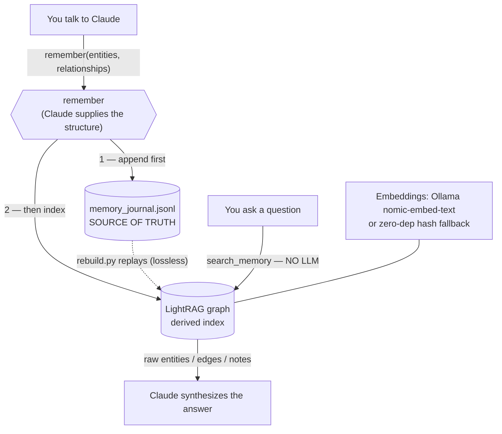

# Personal GraphRAG

[](https://github.com/djuvinall/Personal-GraphRAG/actions/workflows/ci.yml)
[](LICENSE)
[](https://www.python.org/)

**A knowledge graph for your own memory that Claude writes to and reads from directly — no second extraction model, and the local stack is optional.**

It's the personal-life version of an MSP GraphRAG proof of concept I built earlier:
same engine (LightRAG + Ollama, reached from Claude.ai over an MCP tunnel), but
re-pointed from "an MSP's companies/tickets/devices" to **you** — your people,
projects, ideas, tools, tasks, notes, and preferences.

The whole thing is built around one idea:

> **Claude is the relationship model.** When Claude learns something worth
> keeping, it works out the entities *and the edges between them itself* and calls
> one tool — `remember` — which writes them to the graph deterministically. There
> is no second extraction model and no separate relationship model. A local model
> (Ollama) is **optional** and only shows up for embeddings and for offline
> answer-synthesis.

## Why this design

Extraction is the hard part of GraphRAG, and it's exactly what a strong model is
good at. So I let the strong model (Claude, already in the loop) do it, and keep
the local stack for the boring, cheap parts: embedding and storing. The earlier
MSP PoC learned the hard way that a weak 3B model won't honor an entity-type
vocabulary and produces generic, mistyped nodes. Here that problem can't happen on
the main path: **types and edges are set in code from Claude's structured input,
never guessed by a small model.**

## Architecture



Two durability guarantees make this safe to trust for years:

1. **Every write hits the append-only journal first.** Even if the graph index
   write fails (e.g. Ollama is down), the memory is saved; `rebuild.py` indexes it
   later.
2. **The graph is disposable.** It's a derived index. Lose it, corrupt it, or
   switch embedding backends — `python rebuild.py` reconstructs it from the
   journal, exactly.

## Quickstart

```bash
# 0) (recommended) virtualenv + deps
python -m venv venv && . venv/bin/activate      # Windows: venv\Scripts\activate
pip install -r requirements.txt

# 1) plant some starter memories (grounded in your setup) and build the graph
python seed_memory.py

# 2) sanity-check it (offline, no Ollama needed)
python memory_health.py
python recall.py "what is Devon building and what does it use?"

# 3) serve it to Claude.ai
python mcp_server.py        # http://0.0.0.0:8000/  — expose with ngrok, add as a connector
```

**Don't have Ollama yet?** Run everything with the zero-dependency embedder:

```bash
# Windows PowerShell:  $env:PMEM_EMBED_BACKEND="hash"
export PMEM_EMBED_BACKEND=hash
python seed_memory.py && python recall.py "my homelab projects"
```

`hash` needs no model and no service (lower retrieval quality). Switch to the
quality default any time with `nomic-embed-text` pulled in Ollama, then
`python rebuild.py`.

## Results

Real output from the seed graph on the zero-dependency `hash` backend (no Ollama),
so it reproduces anywhere:

```console
$ PMEM_EMBED_BACKEND=hash python seed_memory.py
$ python memory_health.py
  current-state (replayed): 10 entities, 10 relationships
  types: tool=4, project=2, concept=2, person=1, preference=1
  UNKNOWN-typed: 0  [OK]
  isolated nodes: 0  [OK]
```

The graph is connected and correctly typed — **0 UNKNOWN types, 0 isolated
nodes** — with `Personal GraphRAG` as the natural hub (degree 8):

```console
$ python recall.py "Personal GraphRAG"          # get_relationships view
Personal GraphRAG -[uses]->        LightRAG
Personal GraphRAG -[uses]->        Ollama
Personal GraphRAG -[uses]->        FastMCP
Personal GraphRAG -[uses]->        ngrok
Personal GraphRAG -[part_of]->     GraphRAG
Personal GraphRAG -[uses]->        Model Context Protocol
Personal GraphRAG -[inspired_by]-> MSP GraphRAG PoC
Devon            -[works_on]->     Personal GraphRAG
```

No-LLM semantic search returns ranked raw context for Claude to reason over:

```console
$ PMEM_EMBED_BACKEND=hash python recall.py "local model tooling"
ENTITIES:
  [0.26] Model Context Protocol
  [0.25] Ollama
```

The full write → index → search → forget → journal-rebuild loop is exercised
end-to-end in `test_integration.py`, which runs on this same `hash` backend.

## The tools Claude gets (10)

**Write (Claude-driven, deterministic):** `remember` · `link` · `forget`
**Read (no LLM — Claude synthesizes):** `search_memory` · `get_entity` ·
`get_relationships` · `memory_stats` · `browse` · `recent_memories`
**Optional (local LLM):** `recall`

See [`docs/MCP_TOOLS.md`](docs/MCP_TOOLS.md) for signatures and examples.

## What you can put in it (the taxonomy)

- **14 entity types:** person, project, concept, tool, task, goal, note,
  preference, resource, event, place, organization, skill, habit.
- **12 life-domain categories:** gamedev, homelab, dev, work, learning, gaming,
  personal, health, finance, social, creative, ideas.
- **Free-form tags** (many per entity) and a recommended **relation vocabulary**
  (`works_on`, `uses`, `knows`, `part_of`, `depends_on`, `prefers`, …).

Types are a closed set (with sensible aliases); categories grow as you need them;
tags and relations are open. Full reference: [`docs/SCHEMA.md`](docs/SCHEMA.md).

## Connecting to Claude.ai

Run `mcp_server.py`, tunnel `localhost:8000` with ngrok, and add the **bare HTTPS
URL** as a custom connector (path `/`, OAuth blank). The root-path mount and
manifest-cache gotchas are documented in [`docs/RUNBOOK.md`](docs/RUNBOOK.md).

## How it works (the why)

For the reasoning behind the big decisions — why Claude does the extraction, why
the journal is the source of truth, why the read path has no LLM, and what the
trade-offs are — see [`docs/ARCHITECTURE.md`](docs/ARCHITECTURE.md).

## Project layout

| File | Role |
|---|---|
| `schema.py` | The taxonomy: entity types, categories, relations + normalization. Pure. |
| `journal.py` | Append-only JSONL journal — the source of truth. Pure. |
| `memory_store.py` | Claude payload → LightRAG `custom_kg`; replay + rebuild + integrity. Pure. |
| `memory_api.py` | The operations (remember/search/…) — shared by the server and CLIs. |
| `lightrag_setup.py` | LightRAG instance; pluggable embeddings (ollama/hash) + optional LLM. |
| `mcp_server.py` | FastMCP server — the 10 tools, mounted at `/`. |
| `rebuild.py` | Rebuild the graph from the journal (lossless). |
| `seed_memory.py` | Starter memories grounded in your setup. |
| `add_memory.py` / `recall.py` | CLIs to write / query without a Claude session. |
| `memory_health.py` | Offline health check (journal + graph), no Ollama. |
| `extract_local.py` | **Optional** local-model extraction from raw text. |
| `test_memory.py` / `test_integration.py` | Offline pure tests / end-to-end (hash backend). |

## Status & roadmap

Built and verified end-to-end with the `hash` backend (no Ollama): structured
writes, no-LLM retrieval, graph primitives, forget, and a **lossless
journal→graph rebuild** all pass (`python test_memory.py && python
test_integration.py`). Type integrity is clean (0 UNKNOWN nodes, 0 isolated nodes
on the seed graph). The optional `recall`/`extract_local` paths need a running
Ollama.

Next, roughly in priority order:

- **Auth on the tunnel.** Today it's a single-host/single-user PoC with no auth on
  the ngrok tunnel — fine for one machine, required before any wider exposure.
- **A stable hostname** instead of an ephemeral ngrok URL.
- **Embedding-backend migration helper** (currently a manual `rebuild.py`).
- **Optional richer retrieval tuning** for the `recall` synthesis path.

## License

Apache License 2.0 — see [`LICENSE`](LICENSE) and [`NOTICE`](NOTICE). Built on
[LightRAG](https://github.com/HKUDS/LightRAG) and adapted from a private MSP
GraphRAG proof of concept.

See [`CLAUDE.md`](CLAUDE.md) for the working guide and gotchas.
